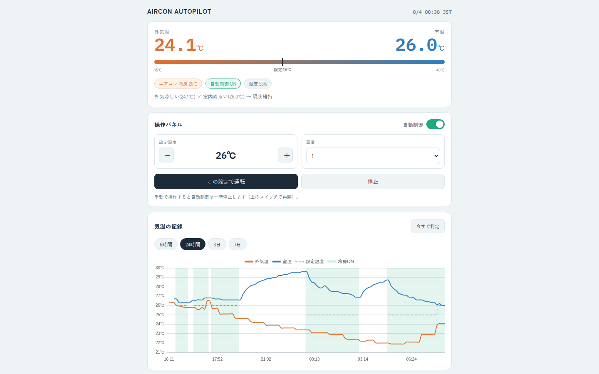

# Aircon Autopilot

外気温（Open-Meteo、気象庁MSMモデル）と室温（Nature Remo）から、エアコンの設定温度・風量・電源を自動制御するアプリです。Webダッシュボードで現在の状況確認・手動操作・気温記録グラフの閲覧ができます。



外出時にRemoアプリのオートメーションでオフにされると、自動制御は一時停止します（帰宅オンで自動再開）:


## できること

- 10分ごとに外気温×室温を判定し、エアコンを自動制御（冷房）
- 外気が涼しいときは冷房をやめて**送風**に切り替え（外気冷却モード。送風非対応機なら電源オフ）
- 温度帯の切替にヒステリシス（0.7℃）＋操作後15分の保持時間 → 設定が細かく揺れない
- 機種が対応していない温度・風量は、対応する最も近い値へ自動で丸め
- 設定が変わるときだけAPIを呼ぶ（Nature RemoのAPI回数制限対策）
- ダッシュボード: 外気温/室温/湿度の現在値、操作パネル（電源・温度・風量・送風・自動ON/OFF）、6時間〜7日の温度グラフ
- 手動操作すると自動制御は一時停止（勝手に上書きされない）。トグルで再開
- リモコンやRemoアプリ・オートメーションで外部からオフにされたら自動制御を一時停止し、外部からオンされたら自動再開する
- 全記録をSQLiteに保存

## セットアップ

```bash
cd aircon-autopilot
python3 -m venv .venv && source .venv/bin/activate
pip install -r requirements.txt

cp .env.example .env
# .env を編集して NATURE_ACCESS_TOKEN を設定
```

Nature Remo のトークンは https://home.nature.global で発行できます。

### 自宅座標の設定

既定は東京駅（`35.6812` / `139.7671`）です。最寄りの外気温にする場合は、Googleマップ等で
自宅の場所を右クリックして表示される緯度・経度をコピーし、`.env` の `LATITUDE` / `LONGITUDE`
に設定してください。

外気温の取得元は [Open-Meteo](https://open-meteo.com/)（気象庁MSMモデル）で、APIキー不要・
非商用利用は無料です。

## 起動

```bash
uvicorn app.main:app --host 0.0.0.0 --port 8000
```

ブラウザで `http://<サーバーのIP>:8000` を開くとダッシュボードが表示されます。
起動と同時に制御ループが動き始めます（初回は即時実行、以後は `CONTROL_INTERVAL_MIN` 分ごと）。

### Raspberry Pi 等での常駐（systemd）

`/etc/systemd/system/aircon-autopilot.service`:

```ini
[Unit]
Description=Aircon Autopilot
After=network-online.target

[Service]
WorkingDirectory=/home/pi/aircon-autopilot
ExecStart=/home/pi/aircon-autopilot/.venv/bin/uvicorn app.main:app --host 0.0.0.0 --port 8000
Restart=always
RestartSec=10

[Install]
WantedBy=multi-user.target
```

```bash
sudo systemctl enable --now aircon-autopilot
```

### WSL2 での常駐（ユーザーsystemd）

sudo なしで済むユーザー単位のサービスを使う（`loginctl enable-linger` 済みであること）。
リポジトリ直下の `aircon-autopilot.service` を配置して有効化する:

```bash
mkdir -p ~/.config/systemd/user
cp aircon-autopilot.service ~/.config/systemd/user/
systemctl --user daemon-reload
systemctl --user enable --now aircon-autopilot
```

Windows 再起動後は WSL 自体が止まっているため、スタートアップフォルダ
（`shell:startup`）に `wsl.exe -d Ubuntu --exec /bin/true` を非表示実行する
`.vbs` を置いてログオン時に WSL を起こす（WSL が起動すれば linger 設定により
サービスも自動で立ち上がる）。

## 制御ロジック

| 外気温 ＼ 室温 | 暑い (≥27℃) | ぬるい (25–27℃) | 快適 (<25℃) |
|---|---|---|---|
| **猛暑 (≥33℃)** | 19℃ / 強 | 23℃ / 強 | 26℃ / 弱 |
| **夏日 (28–33℃)** | 22℃ / 強 | 24℃ / 強 | 26℃ / 弱 |
| **涼しい (<28℃)** | 27℃ / 弱 → *送風* | 26℃ / 弱 → *送風* | **電源オフ** |

- しきい値をまたいでも ±0.7℃（`HYSTERESIS`）動くまで帯は変わりません
- 一度操作したら `MIN_HOLD_MIN`（既定15分）は次の操作をしません
- リモコン・Remoアプリ・オートメーションなどアプリの外からエアコンをオフにされると、自動制御は `paused_external`（一時停止）状態になり、以後は記録のみで操作しません。外部からオンにすると自動的に再開し、その回の判定は保持時間の制限を受けずに即座に最適化されます
- 「涼しい×暑い」の目標温度だけは `COOL_OUT_HOT_TARGET`（既定27℃）で変えられます。外が涼しいなら軽く冷やすだけで十分で、25℃だと全力運転になりエアコンの近くが寒くなるためです
- それ以外のマトリクスを変えたい場合は `app/logic.py` の `MATRIX` を編集してください

### 外気冷却モード（送風）

外が十分涼しいのに室温だけ高い状態では、冷房を回すのは無駄なので**送風**に切り替えます
（表の *送風* の部分）。マトリクスの結果を後段で上書きする形なので、`MATRIX` の意味は
変わりません。

突入する条件（すべて満たすとき）:

- 自動制御がONで、通常判定の結果が冷房ON
- 外気温 ≤ `FREE_COOL_OUT_MAX`（既定25.0℃）
- 湿度 ≤ `FREE_COOL_HUMID_MAX`（既定70%）※湿度が取れないときは条件を満たす扱い
- 室温 < `FREE_COOL_ABORT_ROOM`（既定30.5℃）
- 冷房復帰直後のロックアウト中でない

冷房へ戻る条件:

- 室温が `FREE_COOL_ABORT_ROOM`（既定30.5℃）以上、**かつ**送風を始めたときより
  `FREE_COOL_RISE_MIN`（既定0.5℃）以上上がったとき。室温が高くても横ばい〜下降なら、外が涼しい限り
  送風を続けます（送風は外気を取り込まないので、換気の悪い部屋では室温が高いまま張り付くことがあり、
  絶対値だけで復帰させると送風と冷房のループになるため）
- 復帰後は `FREE_COOL_LOCKOUT_MIN`（既定45分）は送風へ戻らないので、行ったり来たりしません
- 外気温が上がった／湿度が上がって条件を外れたときも、自然に通常マトリクスへ戻ります
- 「一定時間下がらなければ戻す」といった時間ベースの復帰はしません。外が涼しければ室温27℃台でも
  体感的にエアコンは不要、という考え方です

補足:

- 外気温のしきい値にもヒステリシスがかかります。既定値なら「入るには25.0℃以下、出るには25.7℃超」
- 送風時の風量は弱め（`min`）を使い、設定温度は送りません（送風で温度を受け付けない機種があるため）
- **送風に対応していない機種では電源オフにフォールバック**します。対応可否は Nature Remo が返す
  運転モード一覧に `blow` が含まれるかで判定します
- 室温が「快適（<25℃）」の帯のときは、送風ではなく従来どおり電源オフです
- `FREE_COOL_ENABLED=false` で機能ごと無効化でき、その場合は従来のマトリクスだけで動きます

| 環境変数 | 既定値 | 説明 |
|---|---|---|
| `FREE_COOL_ENABLED` | `true` | 外気冷却モードを使うか |
| `FREE_COOL_OUT_MAX` | `25.0` | 突入できる外気温の上限（℃） |
| `FREE_COOL_HUMID_MAX` | `70.0` | 突入できる湿度の上限（%） |
| `FREE_COOL_ABORT_ROOM` | `30.5` | この室温以上で冷房へ復帰（℃） |
| `FREE_COOL_RISE_MIN` | `0.5` | 復帰には送風開始時からこれだけの上昇が必要（℃） |
| `FREE_COOL_LOCKOUT_MIN` | `45` | 復帰後、再突入を禁止する時間（分） |
| `COOL_OUT_HOT_TARGET` | `27.0` | 外気が涼しく室温が暑いときの冷房目標（℃） |

## API

| メソッド | パス | 説明 |
|---|---|---|
| GET | `/api/status` | 現在値・エアコン状態（運転モード `mode`、対応モード `modes`、`supports_blow`）・自動制御の状態（`auto`と`auto_state`: `on`/`off`/`paused_external`）・外気冷却モードの状況（`free_cool`: `active` と再突入禁止の解除時刻 `lockout_until`） |
| GET | `/api/history?hours=24` | 記録の取得（1〜744時間） |
| POST | `/api/auto` `{"enabled": true}` | 自動制御のON/OFF（`paused_external`中でも明示的に上書き可） |
| POST | `/api/aircon` `{"power":"on","mode":"cool","target_temp":"24","air_volume":"2"}` | 手動操作（自動は一時停止）。`mode` は省略時 `cool`、送風は `"blow"`（温度指定は不要） |
| POST | `/api/run-now` | 判定サイクルの即時実行 |

## 記録データ

- 保存先は SQLite（`data/aircon.db`、`DB_PATH` 環境変数で変更可）。`readings` テーブルに1サイクル1行（ts, outdoor, room, humidity, set_temp, air_volume, power, auto, action, note, mode）
- `mode` は運転モード（`cool` / `blow`、停止中は空）。既存のDBには起動時に自動で追加されます（既存データはそのまま）
- 自動削除はなく**無期限に蓄積**されます。10分間隔で年間約5万行・数MB程度なので実用上問題になりません
- ダッシュボードのグラフと `/api/history` が参照できるのは直近31日分まで（データ自体は残ります）

## 注意事項

- **認証はありません。** 自宅LAN内での利用を前提にしています。外出先から使う場合はVPN（Tailscale等）経由にするか、リバースプロキシでBasic認証をかけてください。ポート開放での直公開はしないでください。
- Remo本体の温度センサーは自己発熱でやや高めに出ることがあります。実際の室温計と比べて `ROOM_TEMP_OFFSET`（例: `-1.0`）で補正してください。
- 冷房専用のロジックです。暖房対応は `logic.py` に冬用マトリクスを足す形で拡張できます。
- 送風（`blow`）に対応していない機種では、外気冷却モードは電源オフとして動きます。対応状況は
  ダッシュボードの「送風」ボタンが押せるかどうか、または `/api/status` の `supports_blow` で確認できます。

## テスト

```bash
pip install -r requirements-dev.txt
python -m pytest -q
```

判定ロジック（`app/logic.py`）は外部依存のない純粋関数なので、`tests/test_logic.py` で
温度帯ヒステリシス・外気冷却モードの突入/離脱/ロックアウトを検証しています。

## 構成

```
app/
├── main.py        # FastAPI + 定期実行スケジューラ + API
├── controller.py  # 制御サイクル（取得→判定→操作→記録）
├── logic.py       # 判定マトリクス + ヒステリシス + 外気冷却モード
├── remo.py        # Nature Remo クライアント（対応値への丸め含む）
├── weather.py     # Open-Meteo（気象庁MSMモデル）から外気温取得
├── store.py       # SQLite（記録 + 状態保存）
├── config.py      # .env 設定
└── static/index.html  # ダッシュボード

tests/
├── test_logic.py               # 判定ロジックのテスト（pytest）
└── test_controller_free_cool.py  # 制御サイクルの結合テスト（Remo・天気をモック）
```
